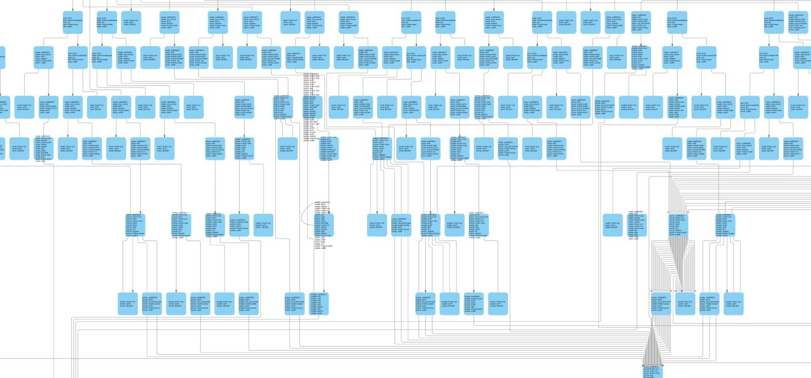

# Pellucid

An EVM decompiler written in Rust.

Still under development. May be unstable when decompiling big contracts.


## Usage

- Clone the repo
- `cargo run --release [mode] [bytecode]`

Possible modes:
- **decompile**: Generate a source code in a langage between Solidity and Yul.
- **disassemble**: Simply convert the bytecode into a list of opcodes.
- **metadata**: Display the metadata of the contract (in solidty: solc version + ipfs hash)
- **graph**: Draw the graph of possible executions of the contract:

```
│ │ │ │      │006d SWAP1          │          │
│ │ │ │      │006e POP            │──┐       │ 
│ │ │ │      └────────────────────┘  │       │
│ │ │ │                              │       │
│ │ │ │      ┌────────────────────┐  │       │
│ │ │ │      │label 10            │<─┘       │
│ │ │ │      │006f JUMPDEST       │          │
│ │ │ │      │0070 PUSH3 0x010010 │          │
│ │ │ │      │0074 DUP2           │          │
│ │ │ │      │0075 LT             │          │
│ │ │ │      │0076 ISZERO         │          │
│ │ │ │      │0077 PUSH2 0x009b   │          │
│ │ │ │ ┌─┬─>│007a JUMPI          │──┬─┬─┬─┐ │
│ │ │ │ │ │  └────────────────────┘  │ │ │ │ │
│ │ │ │ │ │                          │ │ │ │ │
│ │ │ │ │ │  ┌────────────────────┐  │ │ │ │ │
│ │ │ │ │ │  │label 11            │<─┴─┘ │ │ │
│ │ │ │ │ │  │007b DUP1           │      │ │ │
```


## Example

### Solidity source code

```solidity
// SPDX-License-Identifier: MIT
pragma solidity 0.8.7;

contract SimpleContract {
    uint256 public stor;

    function f() external returns (uint256) {
        uint256 length = 12;
        for (uint256 i = 0; i < length; i++) {
            bool res = intern(i);
            stor = res ? i : i;
        }
        return 55 + 12;
    }

    function g() external returns (bool) {
        stor = 55555555555;
        uint256 i = 0;
        while (!intern(i)) {
            unchecked {
                ++i;
            }
        }
        return intern(i);
    }

    function intern(uint256 arg) internal pure returns (bool) {
        return arg > 6;
    }
}
```

### Bytecode

```
0x608060405234801561001057600080fd5b50600436106100415760003560e01c80630dbe671f1461004657806326121ff014610064578063e2179b8e14610082575b600080fd5b61004e6100a0565b60405161005b9190610173565b60405180910390f35b61006c6100a6565b6040516100799190610173565b60405180910390f35b61008a6100f5565b6040516100979190610158565b60405180910390f35b60005481565b600080600c905060005b818110156100ec5760006100c38261012d565b9050806100d057816100d2565b815b6000819055505080806100e4906101a4565b9150506100b0565b50604391505090565b6000640cef5e80e360008190555060005b61010f8161012d565b61011e57806001019050610106565b6101278161012d565b91505090565b6000600682119050919050565b6101438161018e565b82525050565b6101528161019a565b82525050565b600060208201905061016d600083018461013a565b92915050565b60006020820190506101886000830184610149565b92915050565b60008115159050919050565b6000819050919050565b60006101af8261019a565b91507fffffffffffffffffffffffffffffffffffffffffffffffffffffffffffffffff8214156101e2576101e16101ed565b5b600182019050919050565b7f4e487b7100000000000000000000000000000000000000000000000000000000600052601160045260246000fdfea264697066735822122089e2522dad178ca7ec9d442000419cd24591a9a757b7b2605a9cfcf1cb7752f864736f6c63430008070033
```

### Decompile

`cargo run decompile 0x608060405234...`

```solidity
function main() external {
    memory[0x40] = 0x80
    if !(msg.value) {
        if (calldatasize) < 0x04 {
            revert[0x00::0x00]
        }
        else {
            if 0x26121ff0 == ((calldata[0x00]) >> 0xe0) {
                var_0 = 0x00
                begin loop_1 {
                    var_1 = var_0
                    if !(var_1 < 0x0c) {
                        var_2 = memory[0x40]
                        var_3 = fn_0(0x5b, 0x43, var_2)
                        var_4 = memory[0x40]
                        return[var_4::(var_3 - var_4)]
                    }
                    else {
                        var_5 = var_0
                        var_6 = var_5 > 0x06
                        if var_6 {
                            var_7 = var_0
                        }
                        else {
                            var_7 = var_0
                        }
                        var_8 = var_7
                        storage[0x00] = var_8
                        var_9 = var_0
                        var_10 = var_9
                        if !(var_10 == 0xffffffffffffffffffffffffffffffffffffffffffffffffffffffffffffffff) {
                            var_0 = var_10 + 0x01
                            continue loop_1
                        }
                        else {
                            memory[0x00] = 0x4e487b7100000000000000000000000000000000000000000000000000000000
                            memory[0x04] = 0x11
                            revert[0x00::0x24]
                        }
                    }
                }
            }
            else {
                if 0xb28175c4 == ((calldata[0x00]) >> 0xe0) {
                    var_11 = storage[0x00]
                    var_12 = memory[0x40]
                    var_13 = fn_0(0x79, var_11, var_12)
                    var_14 = memory[0x40]
                    return[var_14::(var_13 - var_14)]
                }
                else {
                    if 0xe2179b8e == ((calldata[0x00]) >> 0xe0) {
                        storage[0x00] = 0xcef5e80e3
                        var_15 = 0x00
                        begin loop_0 {
                            var_16 = var_15
                            var_17 = var_16 > 0x06
                            if var_17 {
                                var_18 = var_15
                                var_19 = var_18 > 0x06
                                var_20 = memory[0x40]
                                memory[var_20 + 0x00] = !(!var_19)
                                var_21 = memory[0x40]
                                return[var_21::((var_20 + 0x20) - var_21)]
                            }
                            else {
                                var_22 = var_15
                                var_15 = 0x01 + var_22
                                continue loop_0
                            }
                        }
                    }
                    else {
                        revert[0x00::0x00]
                    }
                }
            }
        }
    }
    else {
        revert[0x00::0x00]
    }
}

function fn_0(var_157, var_158, var_159) internal returns(r0) {
    var_0 = var_158
    memory[var_159 + 0x00] = var_0
    (r0) = (var_159 + 0x20)
}
```


## How does it work ?

### 1) Convert the bytecode into opcodes

This step is the easiest one, it can be visualized with the *disassemble* mode:

`cargo run disassemble 608060405234...`

will result in:

```
0000 PUSH1 0x80
0002 PUSH1 0x40
0004 MSTORE
0005 CALLVALUE
0006 DUP1
0007 ISZERO
...
```

### 2) Seperate the opcodes in **'blocks'**

A block is a continuous series of opcodes that are executed in a row. A block starts at a *jumpdest* or just after a *jumpi*, and ends at a *jump*/*jumpi* or when the execution stops (*revert*, *return*...).

```
┌───────────────────┐  ┌───────────────────────┐  ┌───────────────────┐
│0000 PUSH1 0x80    │  │002b DUP1              │  │0041 JUMPDEST      │
│0002 PUSH1 0x40    │  │002c PUSH4 0xb28175c4  │  │0042 PUSH1 0x00    │
│0004 MSTORE        │  │0031 EQ                │  │0042 PUSH1 0x00    │
│0005 CALLVALUE     │  │0032 PUSH2 0x0064      │  │0044 DUP1          │
│0006 DUP1          │  │0035 JUMPI             │  │0045 REVERT        │
│0007 ISZERO        │  └───────────────────────┘  └───────────────────┘
│0008 PUSH2 0x0010  │  ┌───────────────────────┐  ┌───────────────────┐
│000b JUMPI         │  │0036 DUP1              │  │0046 JUMPDEST      │
└───────────────────┘  │0037 PUSH4 0xe2179b8e  │  │0047 PUSH2 0x004e  │
┌───────────────────┐  │003c EQ                │  │004a PUSH2 0x00a0  │
│000c PUSH1 0x00    │  │003d PUSH2 0x0082      │  │004d JUMP          │
│000e DUP1          │  │0040 JUMPI             │  └───────────────────┘
│000f REVERT        │  └───────────────────────┘          
└───────────────────┘                    

```

### 3) Build the graph of all the possible executions

The steps starting from this point involve non trivial algorithms that deserve a full documentation, and that may evolve in the future. We do not detail them here.



### 4) Detect loops

Pellucid is able to detect loops but still struggles to handle recursive functions (a function that calls itself).

### 5) Detect internal functions

The purpose of this part is to reduce as much as possible the code duplications. The functions detected here are similar to the 'internal' ones of Solidity. The current algorithm has a bad computational complexity and is responsible for the majority of the time consumed by Pellucid.

### 6) Reconstitute the execution flow with variables

Replace the stack operations by high level variables manipulation.

### 7) Simplify variables

Try to reduce the number of lines by replacing some variables by their values when they are used, when it's possible. This step should soon be improved.

## Authors

- @makcandrov
- @ewile
- @AtomicAzzaz
